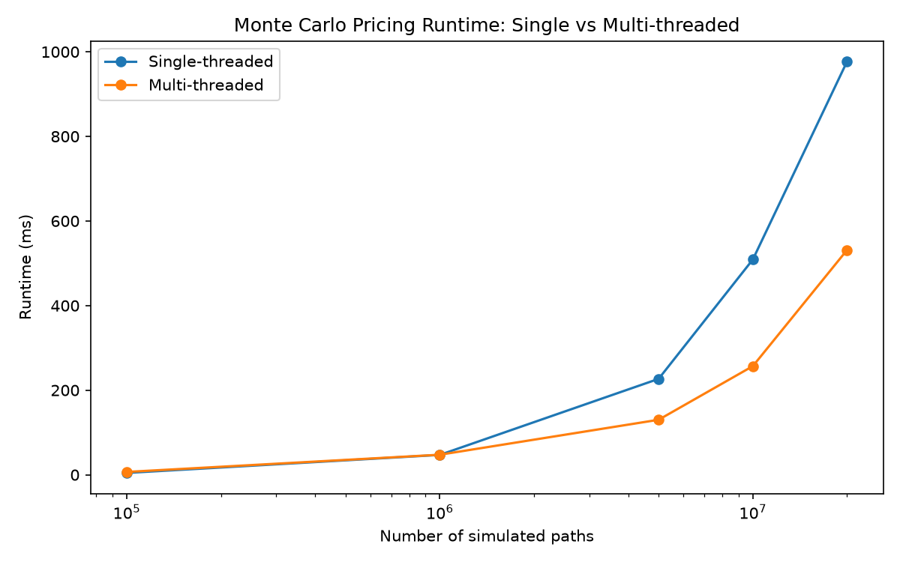
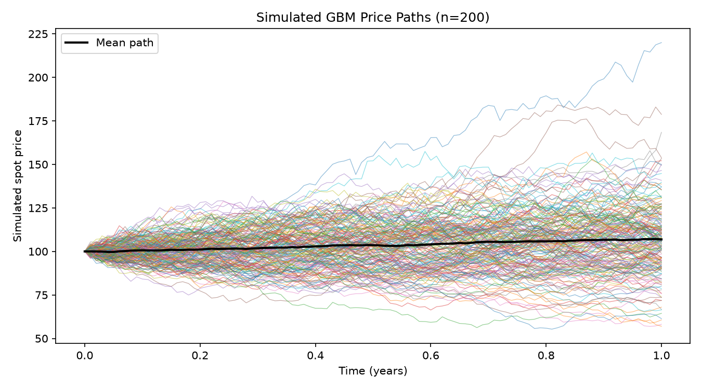
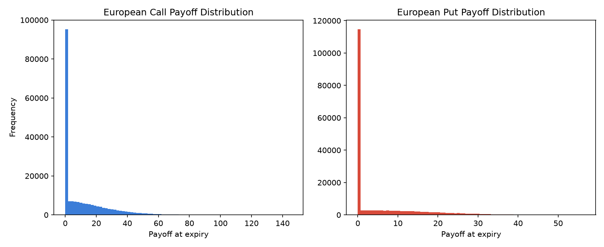

# Parallel Monte Carlo Option Pricing Engine

A multithreaded Monte Carlo engine (C++17) for pricing European options under
Geometric Brownian Motion, plus a Python layer (NumPy/Matplotlib) for
visualizing simulated price paths and payoff distributions.

## How it works

A European option's payoff depends only on the terminal spot price, so the
GBM stochastic differential equation

```
dS_t = r * S_t * dt + sigma * S_t * dW_t
```

can be solved in one step to the terminal price:

```
S_T = S0 * exp((r - 0.5 * sigma^2) * T + sigma * sqrt(T) * Z),   Z ~ N(0, 1)
```

The engine draws millions of independent `Z` samples, evaluates the payoff
(`max(S_T - K, 0)` for a call, `max(K - S_T, 0)` for a put) on each simulated
terminal price, averages them, and discounts at the risk-free rate:

```
Price = e^(-rT) * E[payoff(S_T)]
```

This is the same no-arbitrage pricing framework underlying Black-Scholes; as
the number of paths grows the Monte Carlo estimate converges to the
closed-form Black-Scholes price (verified below).

## Parallelization

`priceMultiThreaded` (see `include/MonteCarloEngine.hpp`) splits the total
path count into contiguous chunks, one per `std::thread`. Each thread:

- owns an independent `std::mt19937_64` RNG stream (seeded per-thread) so
  there's no shared RNG state or lock contention,
- accumulates its partial sum into a `alignas(64)` padded slot, so partial
  sums for different threads never share a CPU cache line (avoids false
  sharing),
- writes into a pre-sized, contiguous `std::vector`, avoiding per-path heap
  allocation in the hot loop.

The partial sums are reduced once all threads join.

## Benchmark (measured on this machine, 12 logical threads)

Run via `./build/monte_carlo_pricer --benchmark`:

| Paths      | Single-threaded | Multi-threaded | Speedup |
|-----------:|-----------------:|---------------:|--------:|
| 100,000    | 4.4 ms           | 6.7 ms          | thread overhead dominates |
| 1,000,000  | 47.0 ms          | 47.4 ms         | ~breakeven |
| 5,000,000  | 226.7 ms         | 130.1 ms        | **42.6%** |
| 10,000,000 | 509.0 ms         | 256.9 ms        | **49.5%** |
| 20,000,000 | 977.2 ms         | 531.6 ms        | **45.6%** |

Thread creation/join overhead outweighs the benefit below ~1M paths; at the
multi-million path counts a pricing engine actually needs for tight
Monte Carlo confidence intervals, parallelizing across cores cuts runtime
roughly in half. Regenerate this table on your own machine with
`--benchmark`; results depend on core count and clock speed.



## Accuracy check

For `Spot=100, Strike=100, r=5%, Vol=20%, T=1`, the closed-form Black-Scholes
price is `Call ≈ 10.45`, `Put ≈ 5.57`. With 5,000,000 paths this engine
produces `Call ≈ 10.44`, `Put ≈ 5.58` — consistent with the analytical price
to within Monte Carlo sampling error.

## Visualizations

`python/visualize.py` reads the CSVs the C++ binary exports with `--export`
and produces:

**Simulated GBM price paths** (fan chart of 200 simulated paths, 100 steps each):



**Terminal payoff distributions** (200,000 samples):



## Building

Requires a C++17 compiler with `<thread>` support.

```bash
g++ -std=c++17 -O3 -DNDEBUG -Iinclude -pthread src/main.cpp -o build/monte_carlo_pricer
```

or with CMake:

```bash
cmake -S . -B build
cmake --build build --config Release
```

## Running

```bash
# Price a call/put with default market data (Spot=100, Strike=100, r=5%, Vol=20%, T=1y)
./build/monte_carlo_pricer --paths 5000000

# Custom market parameters
./build/monte_carlo_pricer --spot 120 --strike 100 --rate 0.03 --vol 0.25 --expiry 0.5 --paths 10000000

# Compare single vs multithreaded runtime across increasing path counts
./build/monte_carlo_pricer --benchmark --out data

# Export CSVs for the Python plots
./build/monte_carlo_pricer --export --out data
```

Then generate the plots:

```bash
pip install -r python/requirements.txt
python python/visualize.py
```

## Project layout

```
include/
  MarketData.hpp       market data struct (spot, strike, rate, vol, expiry)
  Payoff.hpp            call/put payoff function objects
  MonteCarloEngine.hpp   single- and multi-threaded pricing engine
  PathSimulator.hpp      full-path GBM generator, for visualization only
src/
  main.cpp               CLI: pricing, --benchmark, --export
python/
  visualize.py            NumPy/Matplotlib plots from the exported CSVs
data/                     generated CSVs and PNGs (CSVs are gitignored)
```
