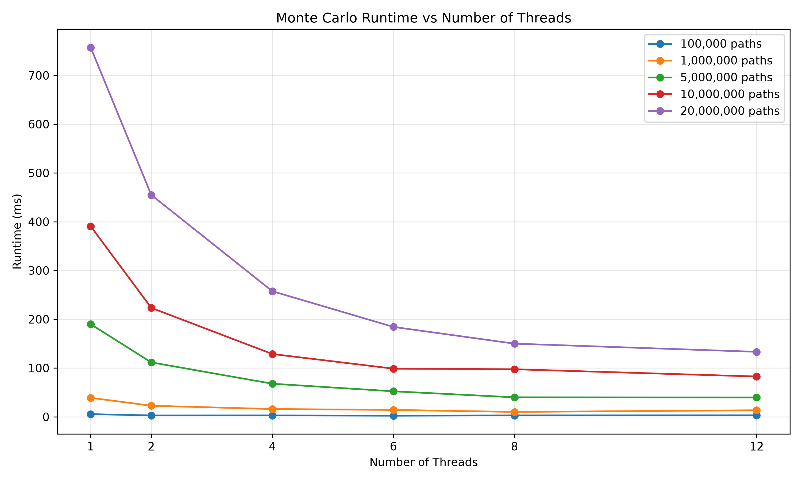
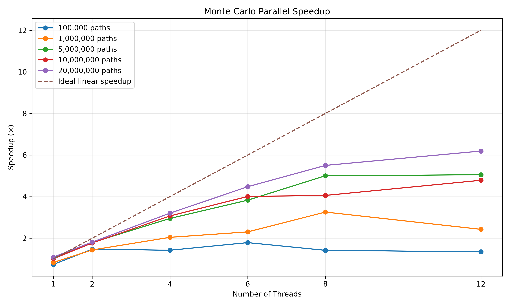
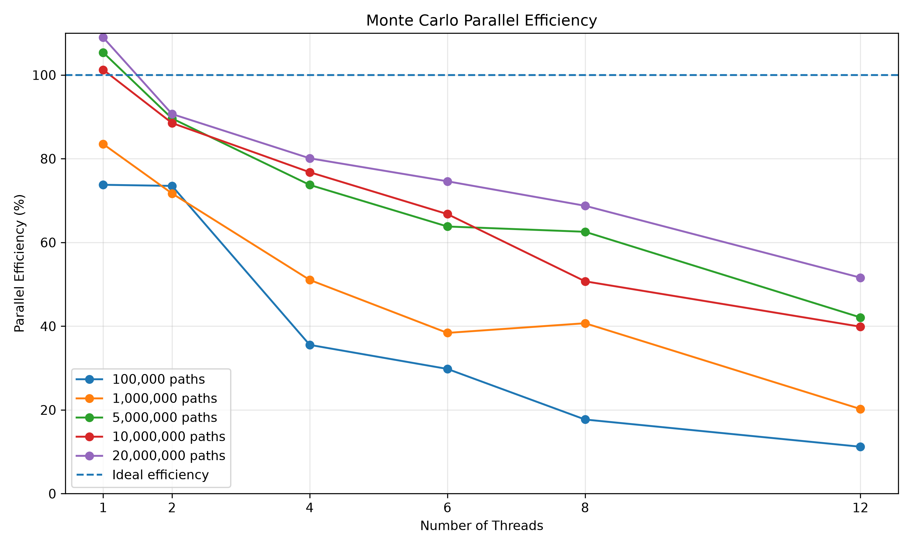
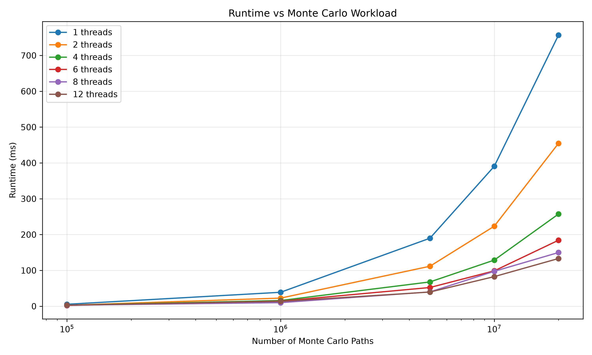

# Parallel Monte Carlo Option Pricing Engine

A parallel Monte Carlo engine written in C++ for pricing European options under Geometric Brownian Motion (GBM), with a Python analysis layer for benchmarking and visualizing simulation results.

The project focuses on **CPU parallelism, strong scaling, cache-aware programming, thread-local state, and performance analysis** while maintaining numerical agreement with the Black-Scholes pricing framework.

## How It Works

A European option's payoff depends only on the terminal stock price, allowing the GBM stochastic differential equation

```text
dS_t = r * S_t * dt + sigma * S_t * dW_t
```

to be solved directly for the terminal price:

```text
S_T = S0 * exp((r - 0.5 * sigma^2) * T
               + sigma * sqrt(T) * Z)

Z ~ N(0, 1)
```

The engine generates millions of independent random samples, computes the terminal stock price and option payoff for each path, averages the simulated payoffs, and discounts the result:

```text
Price = e^(-rT) * E[payoff(S_T)]
```

The resulting Monte Carlo estimate converges toward the corresponding closed-form Black-Scholes price as the number of simulated paths increases.

## Parallelization

Monte Carlo simulation is well suited to parallel execution because individual simulation paths are independent.

The multi-threaded pricing engine divides the total path count into contiguous chunks and distributes the work across CPU threads using `std::jthread`.

Each thread:

* owns an independent `std::mt19937_64` random-number generator stream, avoiding shared RNG state and lock contention;
* maintains its own partial payoff accumulation;
* writes its partial result into an `alignas(64)` padded slot to prevent partial sums from sharing CPU cache lines and reduce false sharing;
* operates on pre-sized contiguous storage, avoiding per-path heap allocation in the hot loop.

After all worker threads complete, their partial sums are reduced to produce the final option price.

This design minimizes synchronization during the computationally intensive portion of the simulation while allowing millions of independent paths to execute concurrently.

## Parallel Scaling Benchmark

The benchmark measures **strong scaling**: the total workload remains fixed while the number of CPU threads increases.

The benchmark was run with 100,000 through 20,000,000 Monte Carlo paths using 1, 2, 4, 6, 8, and 12 threads. Each configuration was executed five times and the median runtime was recorded.

Measured on a machine with 12 logical CPU threads:

|      Paths | Threads | Runtime (ms) |   Speedup | Efficiency |
| ---------: | ------: | -----------: | --------: | ---------: |
|    100,000 |       1 |         5.48 |     0.74× |      73.8% |
|    100,000 |       2 |         2.75 |     1.47× |      73.5% |
|    100,000 |       4 |         2.84 |     1.42× |      35.5% |
|    100,000 |       6 |         2.26 |     1.79× |      29.8% |
|    100,000 |       8 |         2.85 |     1.42× |      17.7% |
|    100,000 |      12 |         3.00 |     1.35× |      11.2% |
|  1,000,000 |       1 |        38.94 |     0.84× |      83.5% |
|  1,000,000 |       2 |        22.67 |     1.43× |      71.7% |
|  1,000,000 |       4 |        15.92 |     2.04× |      51.1% |
|  1,000,000 |       6 |        14.11 |     2.30× |      38.4% |
|  1,000,000 |       8 |         9.98 |     3.26× |      40.7% |
|  1,000,000 |      12 |        13.40 |     2.43× |      20.2% |
|  5,000,000 |       1 |       189.80 |     1.05× |     105.4% |
|  5,000,000 |       2 |       111.58 |     1.79× |      89.6% |
|  5,000,000 |       4 |        67.80 |     2.95× |      73.7% |
|  5,000,000 |       6 |        52.24 |     3.83× |      63.8% |
|  5,000,000 |       8 |        39.97 |     5.00× |      62.6% |
|  5,000,000 |      12 |        39.59 |     5.05× |      42.1% |
| 10,000,000 |       1 |       390.51 |     1.01× |     101.3% |
| 10,000,000 |       2 |       223.33 |     1.77× |      88.5% |
| 10,000,000 |       4 |       128.75 |     3.07× |      76.8% |
| 10,000,000 |       6 |        98.68 |     4.01× |      66.8% |
| 10,000,000 |       8 |        97.44 |     4.06× |      50.7% |
| 10,000,000 |      12 |        82.62 |     4.79× |      39.9% |
| 20,000,000 |       1 |       757.02 |     1.09× |     109.0% |
| 20,000,000 |       2 |       454.81 |     1.81× |      90.7% |
| 20,000,000 |       4 |       257.43 |     3.20× |      80.1% |
| 20,000,000 |       6 |       184.26 |     4.48× |      74.6% |
| 20,000,000 |       8 |       149.94 | **5.50×** |  **68.8%** |
| 20,000,000 |      12 |       133.23 | **6.19×** |  **51.6%** |

The 20-million-path workload achieved a **6.19× speedup using 12 threads**, reducing runtime from approximately 757 ms to 133 ms. At 8 threads, the engine achieved **5.50× speedup and 68.8% parallel efficiency**.

The results also demonstrate diminishing returns as additional threads are introduced. Increasing from 8 to 12 threads reduced runtime by only about 11%, illustrating the effects of thread overhead, memory-system pressure, and limited parallel scalability on this workload.

Smaller workloads scale less effectively because thread creation and scheduling overhead represent a larger fraction of total execution time.

### Runtime vs Threads



### Speedup vs Threads



### Parallel Efficiency vs Threads



### Runtime vs Workload



Benchmark results are stored in `data/benchmark.csv` and can be regenerated with:

```bash
./build/monte_carlo_pricer --benchmark
```

Results will vary across systems depending on CPU architecture, available threads, clock frequency, memory subsystem, operating system, and system load.

## Accuracy Check

For:

```text
Spot   = 100
Strike = 100
Rate   = 5%
Vol    = 20%
Expiry = 1 year
```

the corresponding closed-form Black-Scholes prices are approximately:

```text
Call ≈ 10.45
Put  ≈ 5.57
```

Using 5,000,000 Monte Carlo paths, the engine produces approximately:

```text
Call ≈ 10.44
Put  ≈ 5.58
```

The results are consistent with the analytical prices within expected Monte Carlo sampling error.

## Python Analysis

The Python layer uses **Pandas and Matplotlib** to analyze benchmark results and generate performance visualizations.

The plotting script reads:

```text
data/benchmark.csv
```

and generates:

```text
plots/
├── runtime_vs_threads.png
├── speedup_vs_threads.png
├── efficiency_vs_threads.png
└── runtime_vs_paths.png
```

Create the Python virtual environment and install the dependencies:

```bash
cd python

python3 -m venv .venv
source .venv/bin/activate

pip install pandas matplotlib
```

Generate the plots:

```bash
python plot_benchmarks.py
```

## Building

Requires a modern C++ compiler with C++26 and threading support.

Using `g++`:

```bash
g++ -O3 -march=native -pthread -Iinclude src/main.cpp -o build/monte_carlo_pricer
```

Or with CMake:

```bash
cmake -S . -B build
cmake --build build --config Release
```

## Running

Price a call/put using the default market parameters:

```bash
./build/monte_carlo_pricer --paths 5000000
```

Run with custom market parameters:

```bash
./build/monte_carlo_pricer \
    --spot 120 \
    --strike 100 \
    --rate 0.03 \
    --vol 0.25 \
    --expiry 0.5 \
    --paths 10000000
```

Run the parallel scaling benchmark:

```bash
./build/monte_carlo_pricer --benchmark
```

Export simulation data for Python analysis:

```bash
./build/monte_carlo_pricer --export
```

## Project Layout

```text
monte-carlo-option-pricer/
│
├── include/
│   ├── MarketData.hpp
│   ├── Payoff.hpp
│   ├── MonteCarloEngine.hpp
│   └── PathSimulator.hpp
│
├── src/
│   └── main.cpp
│
├── python/
│   └── plot_benchmarks.py
│
├── data/
│   └── benchmark.csv
│
├── plots/
│   ├── runtime_vs_threads.png
│   ├── speedup_vs_threads.png
│   ├── efficiency_vs_threads.png
│   └── runtime_vs_paths.png
│
└── README.md
```

## Key Concepts Demonstrated

* C++ multithreading and `std::jthread`
* Thread-level parallelism
* Strong scaling
* Parallel speedup and efficiency
* Work decomposition
* Independent Monte Carlo paths
* Thread-local random-number generation
* Reduction of partial results
* CPU cache locality
* False-sharing avoidance
* Memory allocation optimization
* Numerical simulation
* Monte Carlo convergence
* Black-Scholes validation
* Performance benchmarking
* Python-based data analysis and visualization
